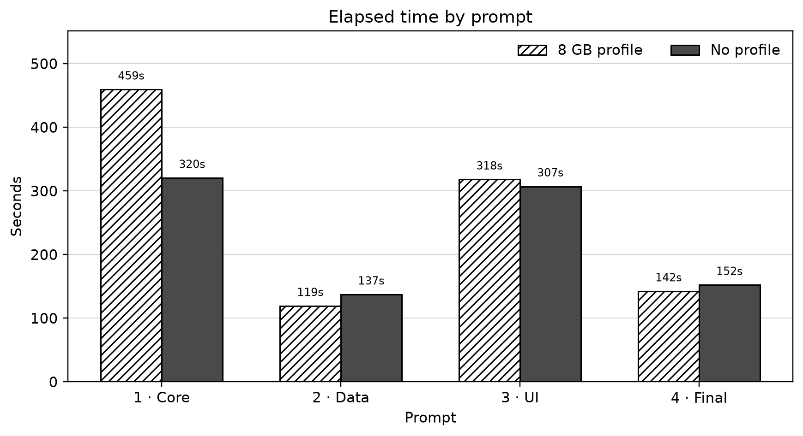
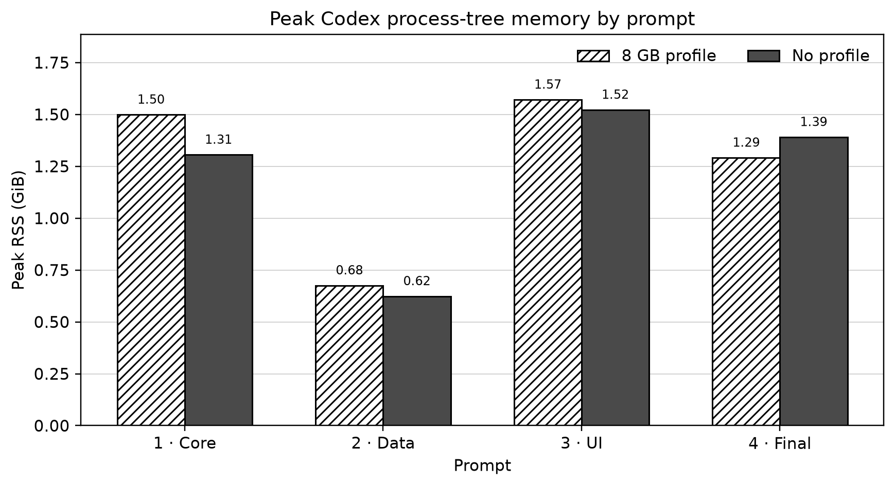
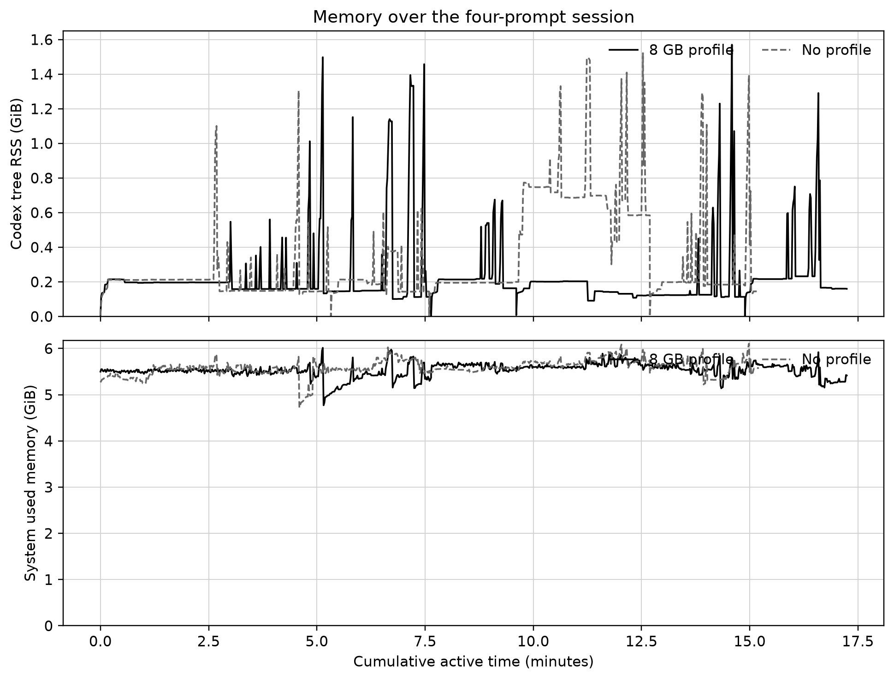
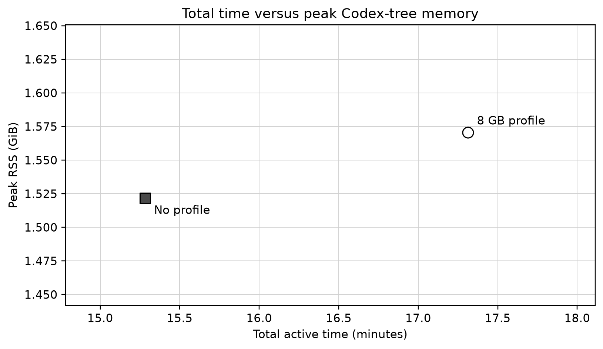

# Codex RAM profile benchmark — 8 GB MacBook

Date: 2026-09-01

Machine memory: 8 GiB unified memory

Codex CLI: 0.144.6

Model: `gpt-5.6-terra`, medium reasoning

Runs: one four-prompt session per condition

## Result

In this single run, the 8 GB profile did **not** reduce the measured peak Codex process-tree RAM. It finished 13.3% slower and its peak process-tree RSS was 3.2% higher. Its average process-tree RSS was 30.7% lower, while peak system-wide used memory was 1.5% lower.

| Metric | 8 GB profile | No profile | Profile difference |
|---|---:|---:|---:|
| Total active time | 17.31 min | 15.28 min | +13.3% |
| Average Codex-tree RSS | 0.22 GiB | 0.32 GiB | -30.7% |
| P95 Codex-tree RSS | 0.61 GiB | 0.75 GiB | -18.0% |
| Peak Codex-tree RSS | 1.57 GiB | 1.52 GiB | +3.2% |
| Peak system used memory | 6.02 GiB | 6.11 GiB | -1.5% |
| Minimum system free memory | 52% | 49% | — |
| Failed shell commands / total | 9 / 40 | 11 / 41 | — |

## Prompt-level measurements

| Prompt | Profile time | No-profile time | Profile peak RSS | No-profile peak RSS |
|---|---:|---:|---:|---:|
| 1 | 459.4s | 320.4s | 1.50 GiB | 1.31 GiB |
| 2 | 119.1s | 137.2s | 0.68 GiB | 0.62 GiB |
| 3 | 318.0s | 307.1s | 1.57 GiB | 1.52 GiB |
| 4 | 142.3s | 152.2s | 1.29 GiB | 1.39 GiB |

## Behavioral observations

- Both conditions completed all four Codex turns with exit code 0 and produced 1,000,000-event, 16-shard workloads.
- The profiled implementation used two analytics workers in its final benchmark; the no-profile implementation used four. Their generated applications and data encodings diverged, so application-level throughput is not an apples-to-apples measure of the instruction file alone.
- During the no-profile dashboard turn, a manually started Next dev server remained running when Playwright tried to start another server. The duplicate-server attempt failed and was retried. The 8 GB profile explicitly asks the agent to reuse one server and clean it up.
- Despite that behavioral win, the profile did not lower overall peak Codex-tree RSS in this run. Prompt 1 implementation variance dominated both total time and the peak comparison.

## Method

Two clean local clones were created from the same seed commit. Dependencies and Playwright Chromium were installed before timing. Only the first clone received `profiles/8gb/AGENTS.md`. Both conditions used the same model, reasoning level, prompt files, package versions, browser cache, and one Codex session continued across four prompts.

The runner sampled once per second. Codex-tree RSS sums the Codex CLI process and all discoverable descendants. System memory comes from `vm_stat`; pressure comes from `memory_pressure -Q`; swap comes from `sysctl vm.swapusage`. Prompt duration begins when `codex exec` starts and ends when that turn exits.

The intended workload was a TypeScript telemetry monorepo with a Next.js dashboard, worker-thread analytics, 1,000,000 deterministic NDJSON events, Vitest integration tests, Playwright browser tests, and a production build. The exact prompts are preserved under [`prompts/`](prompts/).

## Limitations

- This is one run per condition, not a statistically powered benchmark.
- The required order was profile first, then no profile. Filesystem, compiler, browser, and server-side prompt caches may favor the second run.
- Coding-agent output is stochastic. The two agents produced different code, data sizes, worker counts, and intermediate failures. The result measures the complete agent workflow, not only scheduler policy.
- Process-tree sampling can miss a process that fully detaches and is re-parented before a sample.
- System-wide memory includes unrelated macOS and user processes. Starting free-memory baselines were close but not identical.
- A preliminary smoke run exposed harness sandbox and copied-`node_modules` issues. It was discarded, archived separately, and excluded from every reported number.
- The agents ran with approval/sandbox bypass inside dedicated benchmark directories so `tsx`, Next, and Playwright could execute consistently. Prompts constrained work to those repositories.

## Reproduction

Use [`scripts/benchmark_runner.py`](scripts/benchmark_runner.py) with the four locked prompt files. Install dependencies and Chromium before starting, use clean clones, and reverse the condition order in a second replication. A credible conclusion should use at least five alternating A/B and B/A repetitions.

The repository includes the seed manifest, locked prompts, one-second sample CSV files, per-prompt summaries, aggregate data, charts, and analysis code. Full Codex event logs and generated 192–212 MB datasets are intentionally excluded.
