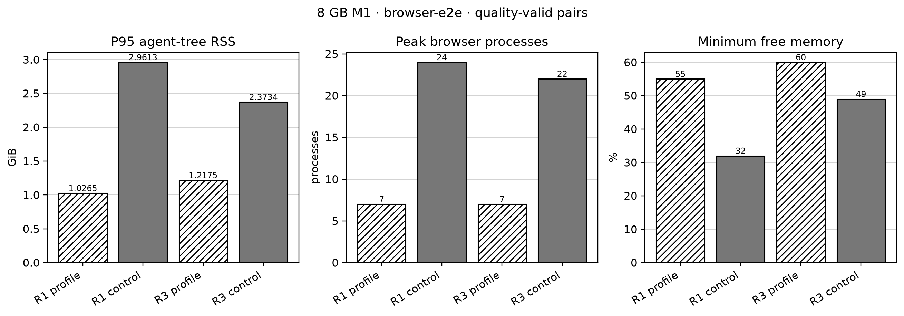

# 8 GB M1 evidence snapshot — 2026-09-02

This is a privacy-reviewed, compact evidence snapshot from the v2 harness. Raw agent JSONL, generated projects, and one-second samples remain local and are not published here.

## Environment

- MacBook Air M1 with 8 GB unified memory
- Codex 0.144.6, `gpt-5.6-terra`, medium effort
- Fresh project and fresh agent session for every condition
- One-second process-tree and system-memory sampling
- Alternating profile/control order
- Profile and control must both pass independent verification for a pair to count

Only the physical 8 GB tier was measured. The 16–128 GB profiles are conservative configured budgets, not measured claims.

## Strongest result: browser-heavy React/Playwright

Two pairs passed the hardened independent gate: typecheck, component tests, all 80 desktop/mobile Playwright cases, production build, required files, and no detected leaked process. The profile used one Playwright worker and one managed server.

| Metric | Median profile delta | Range |
|---|---:|---:|
| Active time | +5.0% | -21.5% to +31.5% |
| Average agent-tree RSS | -40.6% | -67.2% to -13.9% |
| P95 agent-tree RSS | -57.0% | -65.3% to -48.7% |
| Peak agent-tree RSS | -58.9% | -64.2% to -53.7% |
| Peak system-used memory | -9.7% | -13.3% to -6.1% |
| Responsiveness probe P95 | -61.5% | -63.9% to -59.1% |

Profile runs peaked at 13–15 total processes and 7 browser processes. Controls peaked at 26–30 total processes and 22–24 browser processes. Minimum system free memory was 55–60% with the profile versus 32–49% without it.



The signal is large and directionally consistent, but the protocol requires at least three quality-valid pairs before labeling a workload a confirmed benefit. One additional pair was excluded after the independent verifier caught a mixed npm/pnpm project. That finding directly produced the package-manager consistency rule now present in every profile and both skills.

## Other tuning evidence

The current worker-limit candidate also has two quality-valid Rust pairs and one Python data pair. Rust peak RSS fell by a median 28.7%, while P95 RSS was roughly flat (+2.8%). The single Python pair reduced peak RSS by 20.3% but increased active time by 17.9%; it is inconclusive. See `tuning-snapshot.csv` for the compact values.

The plugin-docs diagnostic was not counted: it revealed fixed-command assumptions in the verifier. Both generated projects passed their own Python and TypeScript suites, but the old verifier appended a Jest-only flag to Vitest or assumed a root `test` script. The workload now declares portable root scripts and verifies those exact contracts.

## Reproduce

```sh
python3 benchmarks/v2/harness/preflight.py
python3 benchmarks/v2/harness/runner.py --agent codex --workload browser-e2e --repetitions 3
python3 benchmarks/v2/harness/analyze.py \
  --results benchmarks/v2/results/local \
  --output benchmarks/v2/results/analysis
```

Regenerate the published chart with a Python environment containing Matplotlib:

```sh
python3 benchmarks/v2/evidence/8gb-m1-2026-09-02/render.py
```

## Limitations

- Claude measurements are unavailable because the local Claude Code OAuth session requires user reauthentication.
- Docker is unavailable because the local Docker daemon is not running.
- No higher-memory Mac was available, so those tiers remain unverified.
- Results include normal agent decision variance; more repetitions are required before a final cross-workload claim.
