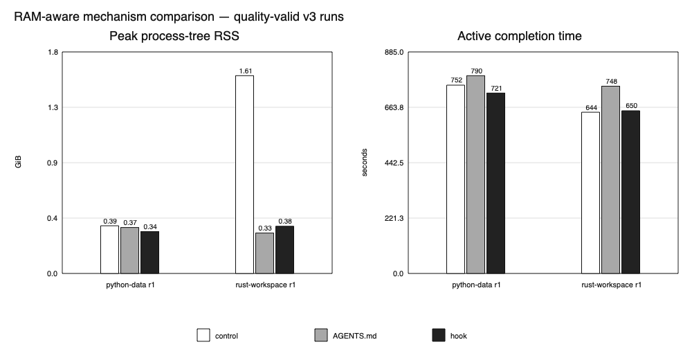

# 8 GB M1 v3 evidence — 2026-09-04

This is a compact, privacy-reviewed tuning snapshot comparing an unconstrained control, the project `AGENTS.md`, and the Codex RAM Guard hook. Raw agent event logs and generated source are intentionally excluded.

## Environment

| Field | Value |
|---|---|
| Machine | Apple M1 MacBook, 8 GB unified memory |
| Codex | `codex-cli 0.144.6` |
| Model | `gpt-5.6-terra / medium` |
| Sampling | Full Codex process tree plus macOS system metrics every second |
| Preflight note | 15.67 GiB free disk; below the protocol 20 GiB preferred threshold, but every case used one disposable project and completed without a disk error |

## Quality-valid results

| Workload | Condition | Active time | P95 RSS | Peak RSS | Process peak |
|---|---|---:|---:|---:|---:|
| python-data | control | 752.2 s | 0.288 GiB | 0.388 GiB | 8 |
| python-data | AGENTS.md | 790.2 s | 0.250 GiB | 0.373 GiB | 7 |
| python-data | hook | 720.8 s | 0.253 GiB | 0.340 GiB | 8 |
| rust-workspace | control | 644.2 s | 0.233 GiB | 1.607 GiB | 32 |
| rust-workspace | AGENTS.md | 748.2 s | 0.215 GiB | 0.329 GiB | 7 |
| rust-workspace | hook | 649.8 s | 0.221 GiB | 0.383 GiB | 8 |

Rust and Python each produced one quality-valid triple. In Rust, `AGENTS.md` reduced peak RSS by 79.5% and the hook by 76.1% versus control; the hook was 13.1% faster than `AGENTS.md`. In Python, `AGENTS.md` reduced P95 RSS by 13.2% and the hook by 12.3%; the hook reduced peak RSS by 12.3% and finished 8.8% faster than `AGENTS.md`.

## Browser diagnostic

Two browser-heavy triples were attempted, but neither was quality-valid across all three arms. In repetition 1, control failed one of 84 independent mobile E2E tests. In repetition 2, the hook artifact's Playwright web server missed its 30-second readiness timeout. These cases remain in `all-case-diagnostics.csv` and are excluded from the comparison chart.

The browser diagnostics still show a resource signal: control peak RSS was 2.54–3.27 GiB with 22 browser processes, while quality-passing `AGENTS.md` cases peaked at 1.31–1.41 GiB with 7–10 browser processes. The hook cases peaked at 1.06–1.41 GiB with 2–7 browser processes, but one failed quality and therefore cannot be counted as a win.

## Decision

This snapshot does not meet the protocol minimum of three quality-valid triples per workload. It supports keeping `AGENTS.md` as the default broad planning mechanism and offering RAM Guard as optional runtime enforcement, not replacing the instruction file universally. The hook has a real shell enforcement boundary and strong peak control, but current Codex hooks cannot cancel a starting subagent and the browser result shows that lower resource use is not sufficient when correctness fails.

Tested hook hashes: `986bea382783a7d7638b311a2c856362ac5140e03bdef74406327823e43e3d1b`.
Current hook hash: `b5cdec3874e2be7a34537151991282de7ec8cb85e149bf5861c976dc3dfb449c`.

The current hook differs from the measured tuning candidate: duplicate startup/resume context injection was removed after telemetry showed ten context events for five prompts, and rewritten tool inputs now preserve non-command fields. The worker/serialization policy is unchanged, but the hardened candidate requires fresh repetitions before final claims.

## Reproduce

See [`../../README.md`](../../README.md) for the three-arm protocol and commands. Local raw results remain ignored by Git.
